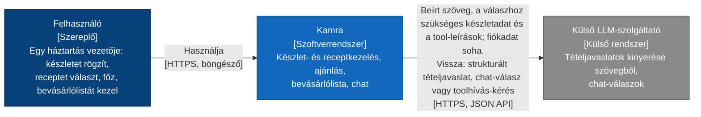
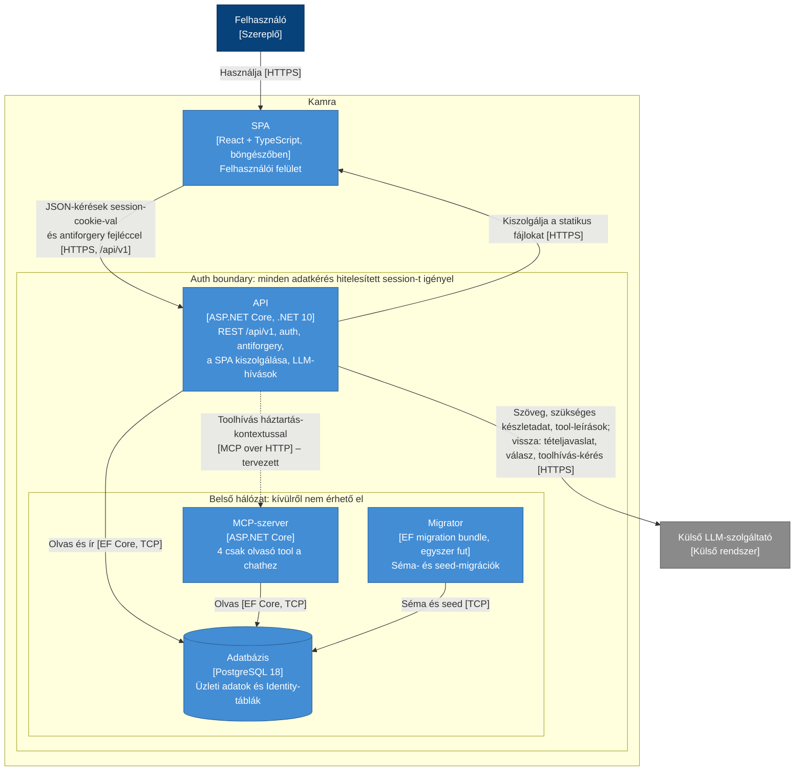
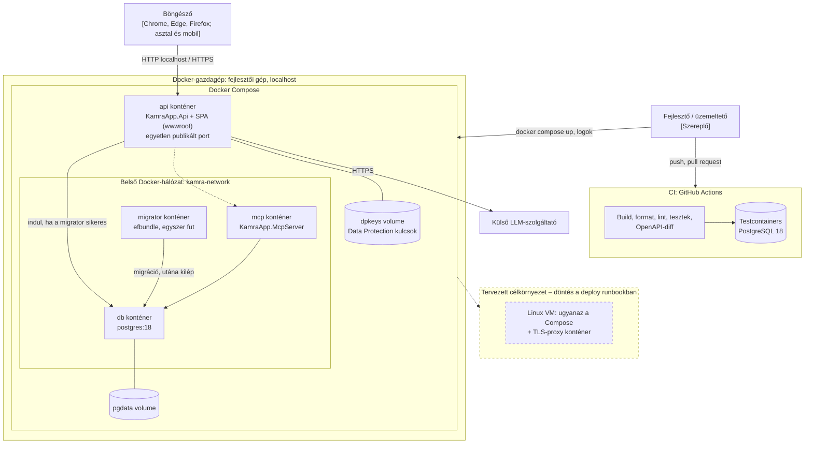

# C4 – Context, Container és Deployment view

A Kamra rendszer környezete, futtatható egységei és telepítése. A diagramok a döntéseket tükrözik: [ADR-0004](adr/0004-clean-architecture-retegek.md) (rétegek, külön MCP-host), [ADR-0005](adr/0005-postgresql-ef-core-migraciok.md) (PostgreSQL, migrator), [ADR-0006](adr/0006-cookie-auth-identity.md) (auth, azonos origin), [ADR-0007](adr/0007-rest-api-hibamodell.md) (REST API). A minőségi elvárások: [quality_attributes.md](quality_attributes.md).

## Jelmagyarázat

| Jelölés | Jelentés |
|---|---|
| Sötétkék doboz | Szereplő (személy) |
| Kék doboz | A Kamra rendszer vagy annak containere |
| Szürke doboz | Külső rendszer |
| Henger | Adattár |
| Keretezett csoport | Határ: auth boundary vagy hálózati határ (a címe megmondja, melyik) |
| Folytonos nyíl | Kapcsolat: mi megy át [protokoll] |
| Szaggatott nyíl / doboz | Tervezett, még ADR-döntésre váró elem |

## 1. Context

| Elem | Felelősség |
|---|---|
| Felhasználó | Egy háztartás vezetője (a [vision.md](../01_product/vision.md) mindkét personája); egy fiók = egy háztartás. |
| Kamra | Készlet, receptek és ajánlás, főzés és készletcsökkenés, bevásárlólista, csak olvasó chat. |
| Külső LLM-szolgáltató | Szövegből tételjavaslatot készít, és a chat kérdéseire válaszol. A konkrét szolgáltató külön ADR-ben dől el. |

## 2. Container

| Container | Technológia | Felelősség | Kódnév |
|---|---|---|---|
| SPA | React + TypeScript (Vite), a böngészőben | Felhasználói felület; minden API-hívás a közös kliensen át | `src/frontend` (`src/api/`) |
| API | ASP.NET Core, .NET 10 | REST `/api/v1` controllerekkel, cookie-alapú auth és antiforgery, a SPA statikus kiszolgálása, LLM-hívások (tételjavaslat, chat) | `KamraApp.Api` |
| MCP-szerver | ASP.NET Core host | Négy csak olvasó tool a chathez, az Application használati eseteken át | `KamraApp.McpServer` |
| Migrator | EF migration bundle | Séma- és seed-migrációk az API és az MCP-szerver indulása előtt; rollback célmigrációval | `KamraApp.Infrastructure` migrációi |
| Adatbázis | PostgreSQL 18 | Üzleti adatok és Identity-táblák | – |

Az API és az MCP-szerver is a saját folyamatában tölti be az Application, a Domain és az Infrastructure réteget ([ADR-0004](adr/0004-clean-architecture-retegek.md)); a rétegek nem külön futtatható egységek, ezért a Container diagramon nem szerepelnek.

| Honnan | Hová | Protokoll | Mi megy át | Hitelesítés |
|---|---|---|---|---|
| Felhasználó (böngésző) | API | HTTPS | A SPA statikus fájljai | – (nyilvános) |
| SPA | API | HTTPS, JSON, `/api/v1` | Készlet-, recept-, bevásárlólista- és chat-kérések | Session-cookie (`HttpOnly`, `Secure`, `SameSite=Strict`) + antiforgery fejléc a módosító kéréseknél |
| API | Adatbázis | TCP (Npgsql) | Lekérdezések és írások, háztartás szerint szűrve | Adatbázis-felhasználó, connection string környezeti változóból |
| API | Külső LLM | HTTPS | A beírt szöveg, a válaszhoz szükséges készletadat és a tool-leírások; fiókadat soha. Vissza: strukturált tételjavaslat, chat-válasz vagy toolhívás-kérés; az LLM nem fér hozzá közvetlenül az adatbázishoz, a toolhívást az API hajtja végre. | API-kulcs környezeti változóból |
| API | MCP-szerver | MCP over HTTP, belső hálózat (tervezett) | Toolhívások; a háztartás-azonosító a sessionből, soha nem az LLM-től | Az MCP-integráció ADR-jének döntése |
| MCP-szerver | Adatbázis | TCP (Npgsql) | Csak olvasó lekérdezések, háztartás szerint szűrve | Adatbázis-felhasználó |
| Migrator | Adatbázis | TCP (Npgsql) | Séma- és seed-migrációk | Migrációs adatbázis-felhasználó |

## 3. Deployment view

| Környezet | Mi fut | Hogyan indul | Konfiguráció |
|---|---|---|---|
| Fejlesztői | Az API `dotnet run`-nal, a SPA a Vite dev serverrel (az `/api` kéréseket az API-ra proxyzza), az adatbázis Compose-ban | `docker compose up -d db`, `dotnet ef database update`, `dotnet run`, `npm run dev` | `appsettings.Development.json` + környezeti változók |
| Docker Compose (localhost) | api (SPA-val), mcp, migrator, db; volume-ok: `pgdata`, `dpkeys`; kívülről csak az api portja érhető el | `docker compose up --build`; a migrator a sikeres lefutás után engedi indulni az api-t és az mcp-t | `.env` (nincs a repóban) a [.env.example](../../.env.example) alapján; induláskor validálva (QA-7) |
| CI (GitHub Actions) | Build, formázás, lint, tesztek (Testcontainers, `postgres:18`), OpenAPI-diff | Push és pull request | CI secretek, valódi LLM-hívás nélkül |
| Tervezett célkörnyezet | Ugyanaz a Compose egy Linux VM-en, TLS-proxy konténerrel | A deploy runbook szerint | A deploy runbook szerint |

## Ismert korlátok

- **MCP-útvonal:** az API és az MCP-szerver közötti hívás mechanizmusa (és a háztartás-kontextus átadása) az MCP-integráció ADR-jében dől el; ha az a toolokat az API folyamatába helyezi, az MCP-szerver container megszűnik.
- **Nincs felhőkörnyezet:** a rendszer Docker Compose-zal, localhoston fut; a célkörnyezet a deploy runbookban dől el.
- **HTTPS:** a session-cookie `Secure`, ezért nem localhost telepítéshez TLS-végződtetés kell (TLS-proxy vagy a platform szolgáltatása).
- **LLM-szolgáltató:** a konkrét szolgáltató és modell külön ADR-ben dől el; a diagram általános külső rendszerként mutatja.
